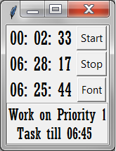

# ScheduleTracker
Displays the current schedule in tkinter based notifier, also keeps displaying the schedule for the current time range



# Usage
Create a `schedule.dat` file with following format, in the same folder from where ScheduleTracker.pyw is run:

```
04:45-05:15 > Get ready > #f00
05:15-05:45 > Exercise
05:45-06:10 > Plan the day > #0f0
06:10-06:45 > Work on Priority 1 Task
06:45-07:05 > Breakfast
07:05-07:15 > Revisit plan
07:15-08:15 > Work on Priority 1 Task
08:15-08:45 > SOF,HN,Coffee
```

Please note, the schedule time range uses 24h time format

# To run
Double click on the file, it will open the application window, where start, stop & font can be chosen

# To make font work
To make the font work, we need to install tkFontChooser

*Without proxy:*

`pip install tkFontChooser`

*With proxy:*

`pip install tkFontChooser --proxy=host:port`

# Compatibility
Runs in Python 3, in Python 2 some packages and methods usage need to be changed
